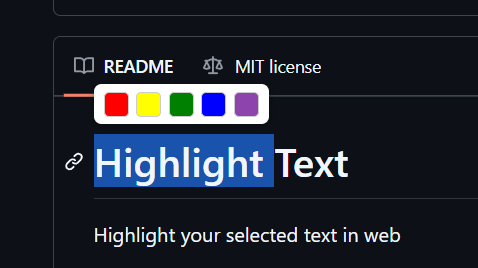

# Highlight Text

Highlight your selected text in web



## Install

Requires the browser to have the [Tampermonkey](https://www.tampermonkey.net/index.php) plugin installed.

[Github](https://raw.githubusercontent.com/qzda/highlight-text/main/dist/highlight-text.user.js)

## Dev

This project is built using [Bun](https://bun.sh/).

```bash
bun i
bun dev
# $ NODE_ENV=dev bun run ./build.ts
# 🧹  Cleaned up dist directory.
# 🔥  Built user-script.
# 📦  Bundled     => dist/highlight-text.user.js
```

Add the `dist/highlight-text.user.js` file to Tampermonkey.
